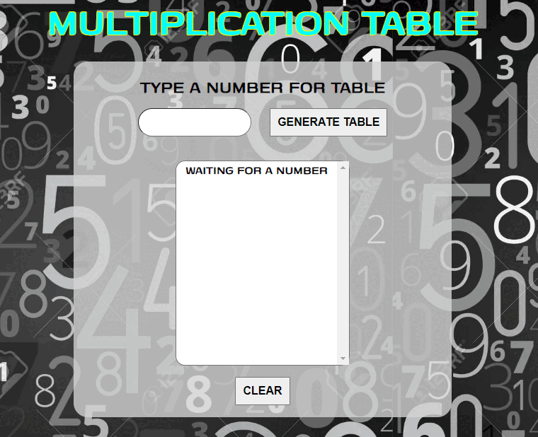

# ❎ ***Multiplication table (Tabela Multiplicadora)*** #

## ***Sobre o projeto*** ##

Este projeto faz parte da lista de exercícios do curso de JavaScript do [Curso em Vídeo](http://cursoemvideo.com/curso/javascript) que propõe o desenvolvimento de uma aplicação web que realiza a tabuada de determinado número informado pelo usuário e retorna todos os resultados de zero (0) a dez (10).

***

 
 

***

## 💻***Tecnologias Aplicadas*** ##

- [JavaScript](https://developer.mozilla.org/pt-BR/docs/Learn/JavaScript/First_steps/What_is_JavaScript)
- [HTML](https://developer.mozilla.org/pt-BR/docs/Learn/Getting_started_with_the_web/HTML_basics)
- [CSS](https://developer.mozilla.org/pt-BR/docs/Glossary/CSS)
- [Photoshop](https://www.adobe.com/br/products/photoshop.html)

 

***Considerações:*** Este projeto além de aplicar os conhecimentos adquiridos durante o curso, tive a oportunidade de explorar alguns conceitos novos como -webkit, regex, exportação de GIF e novas funções como reload() para atualização da página.

***
 

## ***Minhas redes*** ##

  

